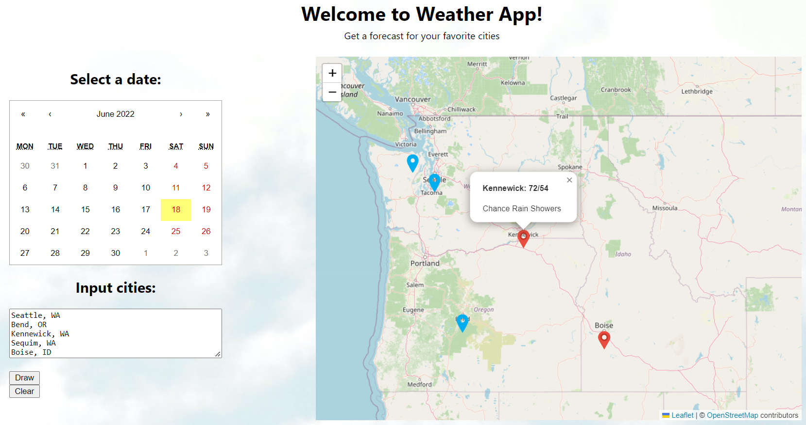

# Weather Map

A React App that allows users to see the forecast for a given day for any US city they input.
These forecasts will be displayed on an interactive map. Cooler forecasts show up with a blue 
marker and warmer ones show up in red.

This project was bootstrapped with [Create React App](https://github.com/facebook/create-react-app).

## Interface

To interact with this project, you'll need to run the scripts below, but here is a peek at what you can
expect:

## Available Scripts

In the project directory, you can run:

### `npm start`

Runs the app in the development mode.\
Open [http://localhost:3000](http://localhost:3000) to view it in your browser.

The page will reload when you make changes.\
You may also see any lint errors in the console.

### `npm run build`

Builds the app for production to the `build` folder.\
It correctly bundles React in production mode and optimizes the build for the best performance.

The build is minified and the filenames include the hashes.\
Your app is ready to be deployed!

See the section about [deployment](https://facebook.github.io/create-react-app/docs/deployment) for more information.

### `npm run build` fails to minify

This section has moved here: [https://facebook.github.io/create-react-app/docs/troubleshooting#npm-run-build-fails-to-minify](https://facebook.github.io/create-react-app/docs/troubleshooting#npm-run-build-fails-to-minify)
